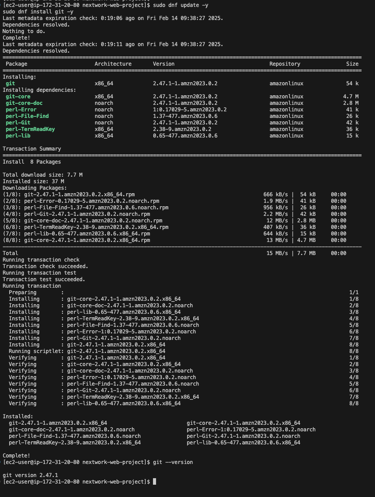
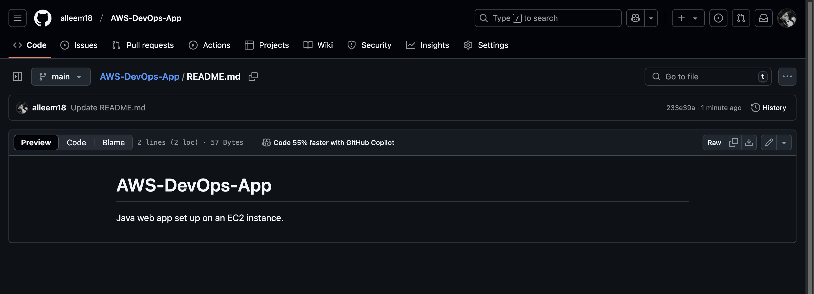
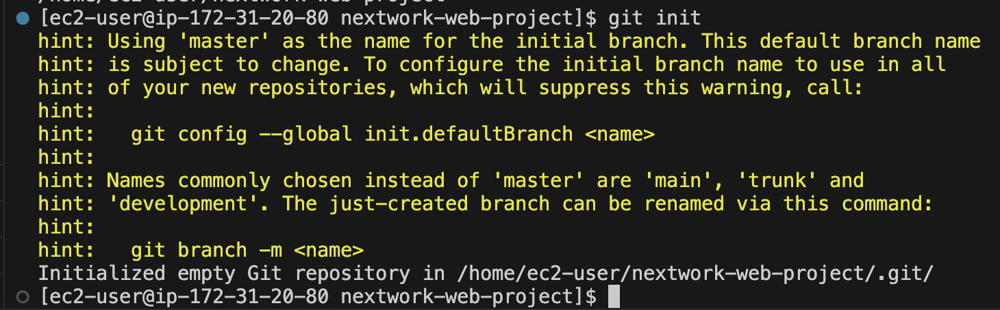
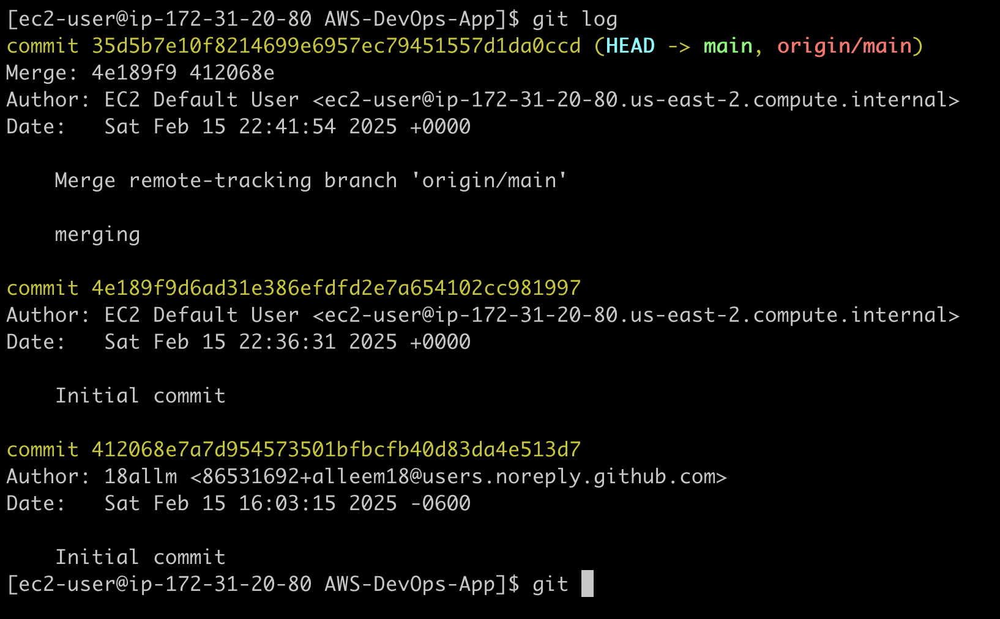
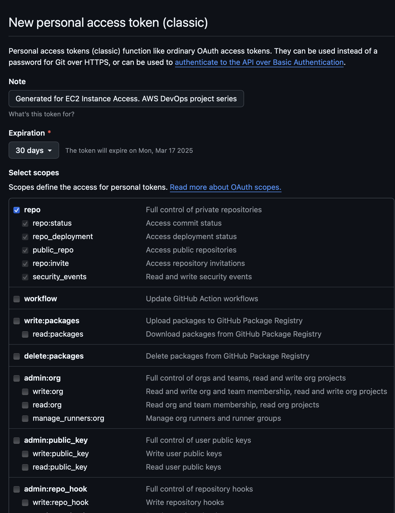
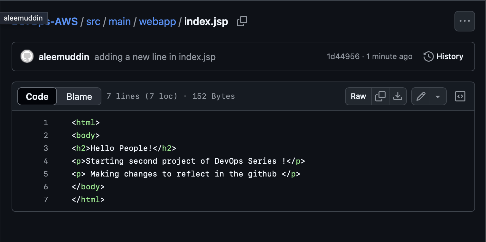
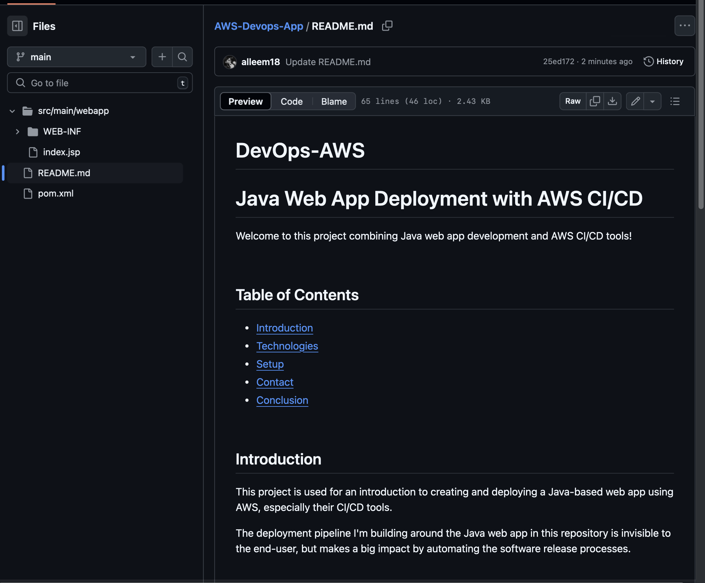

# P2 - Connect a GitHub Repo with AWS

**Author:** Aleemuddin Mohammad  
**Email:** 2747aleem@gmail.com

---

## Connect a GitHub Repo with AWS

---

## Introducing Today's Project!

### What is GitHub?

GitHub is a cloud-based platform for version control and collaboration using Git. Today, I used it to host my project, track changes, and push my code. I initialized Git, added a remote repo, committed files, resolved merge conflicts, and pushed.

### One thing I didn't expect...

One thing I didn’t expect in this project was encountering a push rejection error due to existing commits in the remote repository. I had to fetch and merge remote changes before pushing my code. It was a valuable lesson in handling Git conflicts.

### This project took me...

This project took me around 30 minutes. 

---

## Git and GitHub

Git is like a time machine and filing system for your code. It tracks every change you make, which lets you go back to an earlier version of your work if something breaks. I installed Git using the command: sudo dnf update -y
sudo dnf install git -y

If Git is the tool for tracking changes, think of GitHub as a storage space for different version of your project that Git tracks. I'm using GitHub in this project to store the different versions of the code changes. 

---

## My local repository

A Git repository is to store your code using Git, you create repositories (aka 'repos'), which are folders that contain all your project files and their entire version history

git init is a command that sets up the directory as a local Git repository which means changes are now tracked for version control.I ran git init in the ec2 server terminal. 

After running git init, the response from the terminal was to set a the folder as the repository and as a main branch. A branch in Git is parallel versions of the code .

---

## To push local changes to GitHub, I ran three commands

### git add

The first command I ran was git add . . A staging area  stages all (marked by the '.') files in nextwork-web-project to be saved in the next version of your project.

### git commit

The second command I ran was git commit -m "message" .Using '-m'  flag lets you leave a message describing what the commit is about, making it easier to review what changed in this version.

### git push

The third command I ran was git push -u origin master. Using '-u' means' you're also setting an 'upstream' for your local branch, which means you're telling Git to remember to push to master by default. 

---

## Authentication

Git needs to double check that you have the right to push any changes to the remote origin your local repo is connected with. To do this, Git is now authenticating your identity by asking for your GitHub credentials.

### Local Git identity

Git needs my name and email for commits to track who made what change.

Running git log shows the hiostory of the branch commits, also mentions the author's name.

---

## GitHub tokens

GitHub phased out password authentication to connect with repositories over HTTPS - there are too many security risks and passwords can get intercepted over the internet. You need to use a personal access token instead, which is a more secure metho

A GitHub token is a token expiration limit is how long your personal access token would work for. I'm using one in this project because Git needs to double check that you have the right to push any changes to the remote origin your local repo is conn

I could set up a GitHub token by going to GitHub, selecting Settings > Developer Settings > Personal access tokens > Tokens (classic) >  Generate new token.
Select Generate new token. 

---

## Making changes again

I wanted to see Git working in action, so I have updated the index.jsp file.  I couldn't see the changes in my GitHub repo initially because I didn't push the changes to the github

I finally saw the changes in my GitHub repo after git push command

---

## Setting up a READMe file

As a finishing touch to my GitHub repository, I added a README file, which is is a document that introduces and explains your project, like what the project does, how to set it up, and how to use it. I added a README file in the repo initially.

My README is written in Markdown because you can make words bold, create headers, add links, and use bullet points all with simple symbols added to your text. 

My README file has 6 sections that outline Project name, Introduction, Technologies, Setup, Contact, Conclusion. 

---

---
